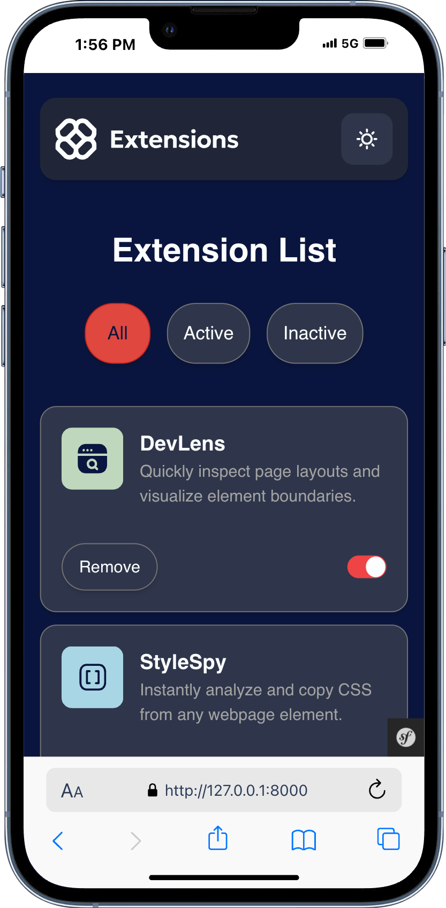
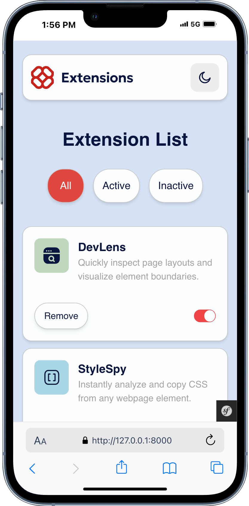
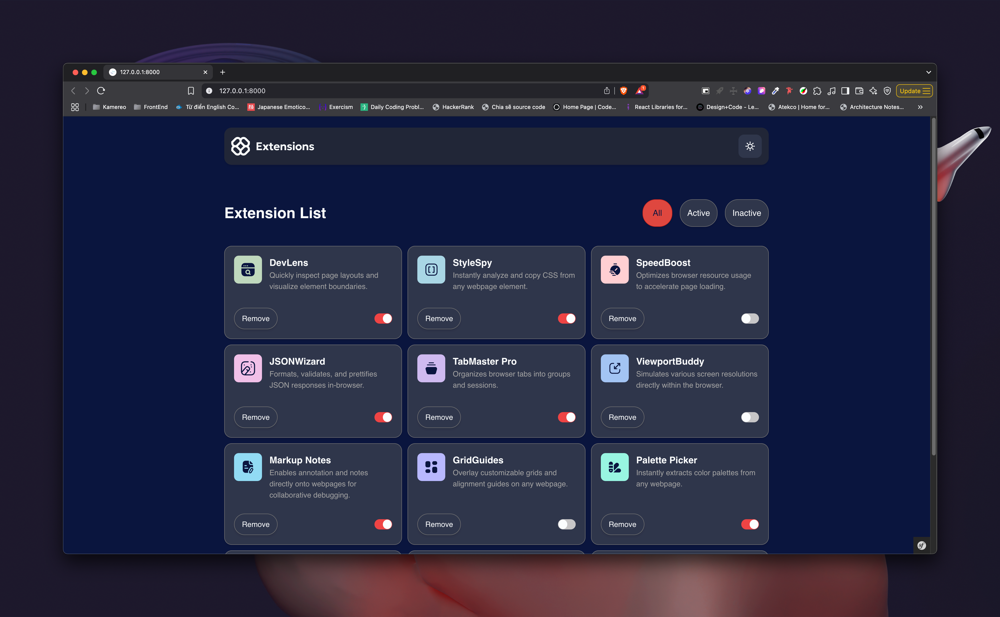
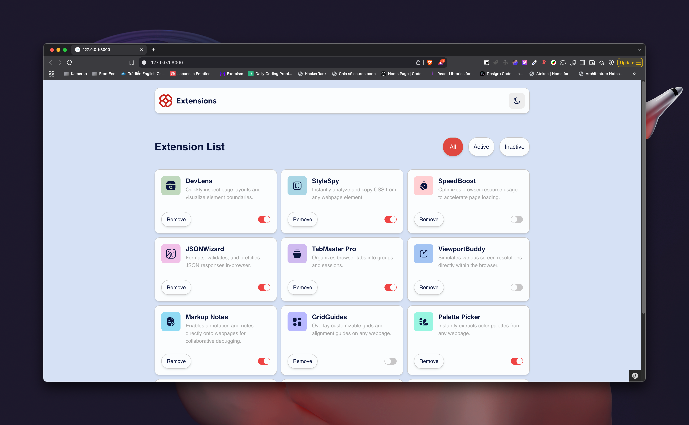

# Frontend Mentor - Browser extensions manager UI solution

This is a solution to
the [Browser extensions manager UI challenge on Frontend Mentor](https://www.frontendmentor.io/challenges/browser-extension-manager-ui-yNZnOfsMAp).
Frontend Mentor challenges help you improve your coding skills by building realistic projects.

## Table of contents

- [Overview](#overview)
    - [The challenge](#the-challenge)
    - [Screenshot](#screenshot)
    - [Links](#links)
- [My process](#my-process)
    - [Built with](#built-with)
    - [What I learned](#what-i-learned)
    - [Continued development](#continued-development)
    - [Useful resources](#useful-resources)
- [Author](#author)
- [Acknowledgments](#acknowledgments)

## Overview

### The challenge

Users should be able to:

- Toggle extensions between active and inactive states
- Filter active and inactive extensions
- Remove extensions from the list
- Select their color theme
- View the optimal layout for the interface depending on their device's screen size
- See hover and focus states for all interactive elements on the page

### Screenshot






### Links

- Solution URL: [Click here](https://github.com/Antonio0402/browser-extension-menu.git)
- Live Site URL: [Click here](https://browser-extension-menu.fly.dev/)

## My process

### Built with

- Semantic HTML5 markup
- CSS custom properties
- Flexbox
- CSS Grid
- Mobile-first workflow
- [Symfony] (https://symfony.com/) - For the backend logic and templating
- [Tailwind CSS](https://tailwindcss.com/) - For styling and responsive design
- [Stimulus](https://stimulus.hotwired.dev/) - For JavaScript interactions

### What I learned

- How to set up an Symfony project with Tailwind CSS and Stimulus from scratch.
- How to create an UI using server-side routing and templating align with MVC principles.
- How to use Stimulus controllers to handle user interactions and manage state in a clean way.

```js
async
removeExtension()
{
    const extensionName = this.element.querySelector('.extension-toggle')?.getAttribute('name');
    const name = extensionName?.replace('extension-toggle-', '');
    await this.#waitForRemove(name);
}

async
#waitForRemove(name)
{
    try {
        const response = await fetch(`/api/extensions/v1/remove/${encodeURIComponent(name)}`, {
            method: 'DELETE',
            headers: {
                'X-Requested-With': 'XMLHttpRequest',
                'Content-Type': 'application/json',
            },
        });

        if (!response.ok) {
            console.log(response.status, await response.text());
            throw new Error('Failed to toggle extension');
        } else {
            // Select the closest parent element with the class 'extension-card'
            const extensionCard = this.element.closest('.extension-card');
            if (extensionCard) {
                // Adding an animation class to fade out the card
                extensionCard.classList.add('fade-out');
                extensionCard.remove();
            }
        }
    } catch (error) {
        console.error(error);
    }
}
```

```php
c    public function __construct(string $jsonFilePath)
    {
        $this->currentFilePath = $jsonFilePath;
        $json = file_get_contents($jsonFilePath);
        $this->extensions = json_decode($json, true) ?? [];
    }
    /*...*/
      public function updateSingle(Extension $extension): void
    {
        foreach ($this->extensions as &$ext) {
            if (strtolower($ext['name']) === $extension->getName()) {
                $ext['isActive'] = $extension->isActive();
                break;
            }
        }
        file_put_contents($this->currentFilePath, json_encode($this->extensions, JSON_PRETTY_PRINT));
    }

    public function removeSingle(Extension $extension): void
    {
        foreach ($this->extensions as $key => $ext) {
            if (strtolower($ext['name']) === $extension->getName()) {
                unset($this->extensions[$key]);
                break;
            }
        }
        file_put_contents($this->currentFilePath, json_encode(array_values($this->extensions), JSON_PRETTY_PRINT));
    }
```

### Continued development

- I plan to continue improving my Symfony skills by building more complex applications and exploring advanced
  features like custom commands, event listeners, and service containers.

### Useful resources

- [Cosmic Coding with Symfony 7](https://symfonycasts.com/screencast/symfony)

## Author

- Website - [Antonio](https://my-astro-portfolio.onrender.com/)
- Frontend Mentor - Frontend Mentor - [@Antonio0402](https://www.frontendmentor.io/profile/Antonio0402)

## Acknowledgments

- So much thanks to SymfonyCasts for their amazing tutorials and resources that helped me understand Symfony and its
  ecosystem. This is also a great resource for anyone looking to learn Symfony and build modern web applications.

